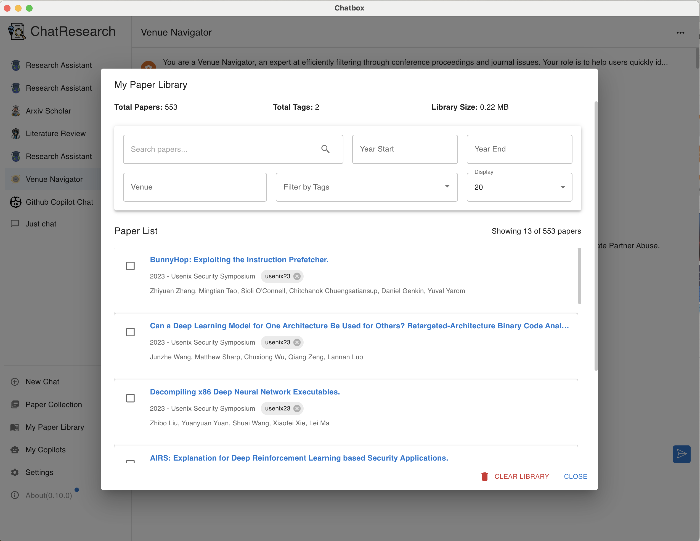

<p align="right">
  <a href="README.md">English</a> |
  <a href="README-CN.md">简体中文</a>
</p>

<h1 align="center">

<span><a href="https://yueyuel.github.io/ResearchChat/">ChatResearch</a></span>
</h1>

<p align="center">
    <em>您的AI驱动的学者和学生研究助手</em>
</p>

<a href="./docs/pic/demo1.png"></a>
<a href="./docs/pic/demo2.png"></a>

## 关于 ChatResearch

ChatResearch 是一款为学生和研究人员设计的AI驱动桌面应用程序，旨在协助他们的学术追求。目前处于预览版阶段，展示了AI辅助研究的未来前景。

### 为什么选择 ChatResearch？

作为研究人员和学生，我们经常会问自己这样的问题：

- "我的研究领域在arXiv上有哪些最新进展？"
- "在ICML、CVPR或USENIX Security等顶级会议上，我所在领域解决了哪些问题？"
- "如何快速总结这篇论文的关键发现？"
- "我的研究领域中还有哪些潜在的研究空白？"

ChatResearch 旨在回答这些问题，并利用AI的力量在几分钟内（而不是几小时）提供洞见。

## 功能特性

- **AI驱动的对话**：与先进的AI模型进行研究讨论。
- **论文库管理**：高效组织和管理您的研究论文。
- **AI辅助论文分析**：快速获取论文摘要和见解。
- **Arxiv集成**：及时了解您所在领域的最新论文。
- **会议论文集分析**：快速理解顶级会议的关键趋势。
- **研究空白识别**：AI辅助分析，帮助识别潜在的研究机会。
- **多语言支持**：使用您偏好的语言进行交流。
- **跨平台可用性**：可在Windows、Mac和Linux上使用。

## 为什么我创建了 ChatResearch

作为一名研究人员，我经常被大量的论文和领域内快速的进展所淹没。我创建ChatResearch是为了应对这些挑战，提供一个工具，可以快速解析信息，提供见解，并帮助研究人员更高效地掌握他们的研究领域。

## 下载桌面版

<table style="width: 100%">
  <tr>
    <td width="25%" align="center">
      <b>Windows</b>
    </td>
    <td width="25%" align="center" colspan="2">
      <b>MacOS</b>
    </td>
    <td width="25%" align="center">
      <b>Linux</b>
    </td>
  </tr>
  <tr style="text-align: center">
    <td align="center" valign="middle">
      <a href='https://github.com/yueyueL/ResearchChat/releases/download/v0.10.0/ChatResearch-0.10.0-Setup.exe'>
        
        <br />
        <b>Setup.exe</b>
      </a>
    </td>
    <td align="center" valign="middle">
      <a href='https://github.com/yueyueL/ResearchChat/releases/download/v0.10.0/ChatResearch-0.10.0.dmg'>
        
        <br />
        <b>Intel</b>
      </a>
    </td>
    <td align="center" valign="middle">
      <a href='https://github.com/yueyueL/ResearchChat/releases/download/v0.10.0/ChatResearch-0.10.0-arm64.dmg'>
        
        <br />
        <b>M1/M2</b>
      </a>
    </td>
    <td align="center" valign="middle">
      <a href='https://github.com/yueyueL/ResearchChat/releases/download/v0.10.0/ChatResearch-0.10.0-arm64.AppImage'>
        
        <br />
        <b>AppImage</b>
      </a>
    </td>
  </tr>
</table>

## 下载说明
您可以从[官方GitHub发布页面](https://github.com/yueyueL/ResearchChat/releases/)下载ChatResearch。

### Windows系统

- 从[发布页面](https://github.com/yueyueL/ResearchChat/releases/)下载 *-win.exe 文件。
- 运行下载的文件以进行安装。

### macOS系统

- 对于M1、M2和其他Apple Silicon Mac，下载arm64.dmg文件。
- 对于基于Intel的Mac，下载常规.dmg文件。
- 首次打开应用程序时，macOS可能会显示有关安装第三方软件的安全警告。要允许安装，请按照[此博客文章](https://helpcenter.trendmicro.com/en-us/article/tmka-20627)中的说明操作。

### Linux系统
- 基于Debian的发行版：从发布页面下载.deb文件。
- 其他发行版：从发布页面下载.AppImage文件。

## 隐私
所有聊天历史记录、设置和论文库数据都保存在您的计算机本地。

## 如何贡献

我们欢迎各种形式的贡献：

1. **提交问题**：报告bug或建议新功能。
2. **提交拉取请求**：贡献代码或文档改进。
3. **功能请求**：分享新功能的想法。
4. **文档**：帮助改进或翻译我们的文档。
5. **测试**：帮助测试新功能并报告您的发现。

## 构建说明

1. 克隆仓库：
   ```
   git clone https://github.com/yueyueL/ResearchChat.git
   ```

2. 安装依赖：
   ```
   npm install
   ```

3. 以开发模式运行：
   ```
   npm run dev
   ```

4. 为您的平台构建：
   ```
   npm run package
   ```

5. 为所有平台构建：
   ```
   npm run package:all
   ```

## 致谢

ChatResearch 是基于 [Chatbox](https://github.com/Bin-Huang/chatbox) 的基础构建的。我们感谢他们的开源贡献，使得这个项目成为可能。

## 许可证

[GPLv3](./LICENSE)

## 联系方式

如有任何疑问或建议，请联系 [Knox](https://yueyuel.github.io)。

---

ChatResearch：用AI赋能您的研究之旅。