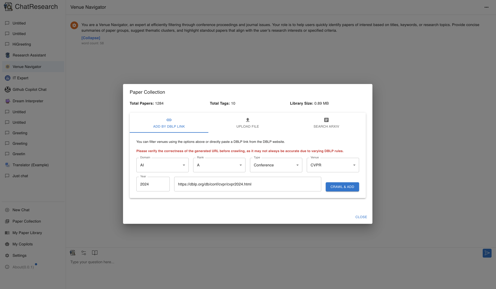
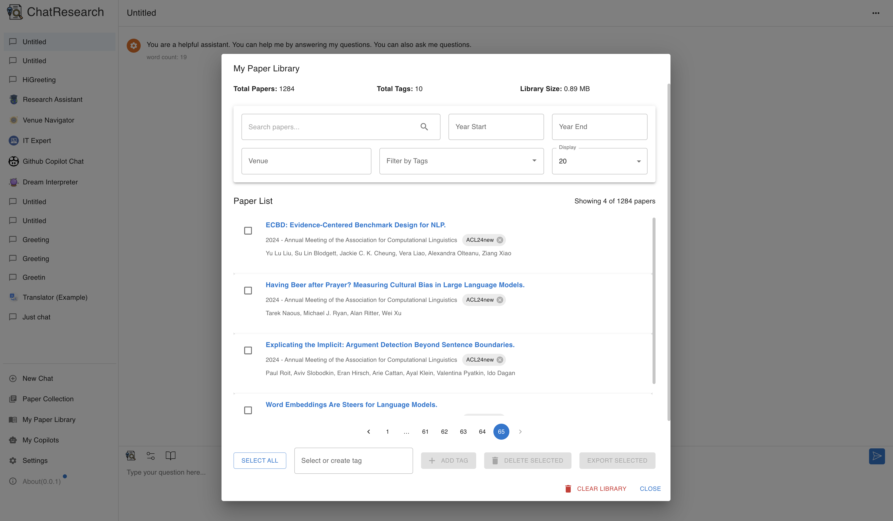

<p align="right">
  <a href="README.md">English</a> |
  <a href="README-CN.md">简体中文</a>
</p>


<h1 align="center">

<span>ChatResearch</span>
</h1>

<p align="center">
    <em>Your AI-Powered Research Assistant for Scholars and Students</em>
</p>


<a href="./doc/demo1.png"></a>
<a href="./doc/demo2.png"></a>

## About ChatResearch

ChatResearch is an AI-powered desktop application designed to assist journal students and researchers in their academic pursuits. It's currently in its preview version, offering a glimpse into the future of AI-assisted research.

### Why ChatResearch?

As researchers and students, we often find ourselves asking questions like:

- "What are the recent updates in my research area on arXiv?"
- "What problems were solved at top conferences in my domain like ICML, CVPR, or USENIX Security?"
- "How can I quickly summarize the key findings of this paper?"
- "What are the potential research gaps in my field?"

ChatResearch is designed to answer these questions and more, leveraging the power of AI to provide insights in minutes, not hours.

## Features

- **AI-Powered Chat**: Engage in research discussions with advanced AI models (e.g., GPT-4, LLama, Deepseek).
- **Paper Library Management**: Organize and manage your research papers efficiently.
- **AI-Assisted Paper Analysis**: Get quick summaries and insights from papers.
- **Arxiv Integration**: Stay updated with the latest papers in your field.
- **Conference Proceedings Analysis**: Quickly understand the key trends from top conferences.
- **Research Gap Identification**: AI-assisted analysis to help identify potential research opportunities.
- **Multi-Language Support**: Communicate in your preferred language.
- **Cross-Platform Availability**: Use on Windows, Mac, or Linux.

## Why I Made ChatResearch

As a researcher, I often found myself overwhelmed by the sheer volume of papers and the rapid pace of advancements in my field. I created ChatResearch to address these challenges, providing a tool that could quickly parse through information, offer insights, and help researchers stay on top of their fields more efficiently.


## Download for Desktop

<table style="width: 100%">
  <tr>
    <td width="25%" align="center">
      <b>Windows</b>
    </td>
    <td width="25%" align="center" colspan="2">
      <b>MacOS</b>
    </td>
    <td width="25%" align="center">
      <b>Linux</b>
    </td>
  </tr>
  <tr style="text-align: center">
    <td align="center" valign="middle">
      <a href='https://github.com/yueyueL/ResearchChat/releases/download/v0.10.0/ChatResearch-0.10.0-Setup.exe'>
        
        <br />
        <b>Setup.exe</b>
      </a>
    </td>
    <td align="center" valign="middle">
      <a href='https://github.com/yueyueL/ResearchChat/releases/download/v0.10.0/ChatResearch-0.10.0.dmg'>
        
        <br />
        <b>Intel</b>
      </a>
    </td>
    <td align="center" valign="middle">
      <a href='https://github.com/yueyueL/ResearchChat/releases/download/v0.10.0/ChatResearch-0.10.0-arm64.dmg'>
        
        <br />
        <b>M1/M2</b>
      </a>
    </td>
    <td align="center" valign="middle">
      <a href='https://github.com/yueyueL/ResearchChat/releases/download/v0.10.0/ChatResearch-0.10.0-arm64.AppImage'>
        
        <br />
        <b>AppImage</b>
      </a>
    </td>
  </tr>
</table>

## Download Instructions
You can download ChatResearch from the [official GitHub releases page](https://github.com/yueyueL/ResearchChat/releases/).

### On Windows

- Download the *-win.exe file from the [releases page](https://github.com/yueyueL/ResearchChat/releases/).
- Run the downloaded file to proceed with the setup.

### On macOS

- For M1, M2, and other Apple Silicon Macs, download the arm64.dmg file.
- For Intel-based Macs, download the regular .dmg file.
- When opening the application for the first time, macOS may show a security warning about installing third-party software. To allow installation, follow the instructions in [this blog post](https://helpcenter.trendmicro.com/en-us/article/tmka-20627).

### On Linux
- Debian-based Distributions: Download the .deb file from the releases page.
- Other Distributions: Download the .AppImage file from the releases page.


## Privacy
All chat history, settings and paper library data are saved locally on your computer.


## How to Contribute

We welcome contributions of all forms:

1. **Submit Issues**: Report bugs or suggest features.
2. **Pull Requests**: Contribute code or documentation improvements.
3. **Feature Requests**: Share ideas for new features.
4. **Documentation**: Help improve or translate our docs.
5. **Testing**: Help test new features and report your findings.

## Build Instructions

1. Clone the repository:
   ```
   git clone https://github.com/yueyueL/ResearchChat.git
   ```

2. Install dependencies:
   ```
   npm install
   ```

3. Run in development mode:
   ```
   npm run dev
   ```

4. Build for your platform:
   ```
   npm run package
   ```

5. Build for all platforms:
   ```
   npm run package:all
   ```

## Acknowledgements

ChatResearch is built upon the foundation laid by [Chatbox](https://github.com/Bin-Huang/chatbox). We're grateful for their open-source contribution which has made this project possible.

## License

[GPLv3](./LICENSE)

## Contact

For any queries or suggestions, please reach out to [Knox](https://yueyuel.github.io).

---

ChatResearch: Empowering your research journey with AI.